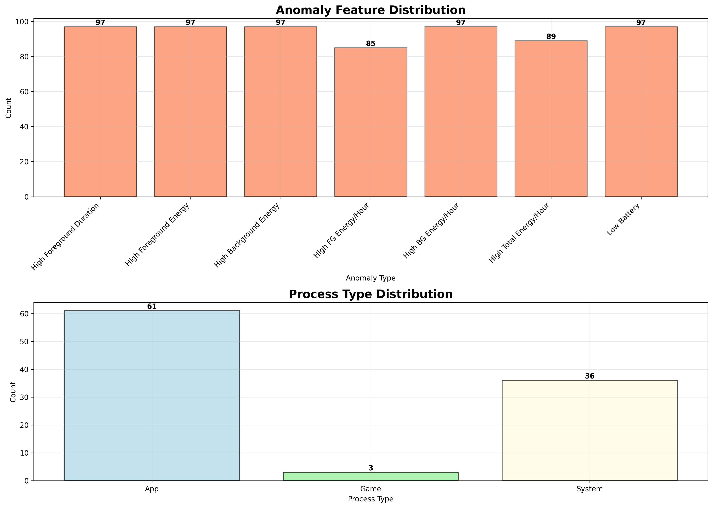
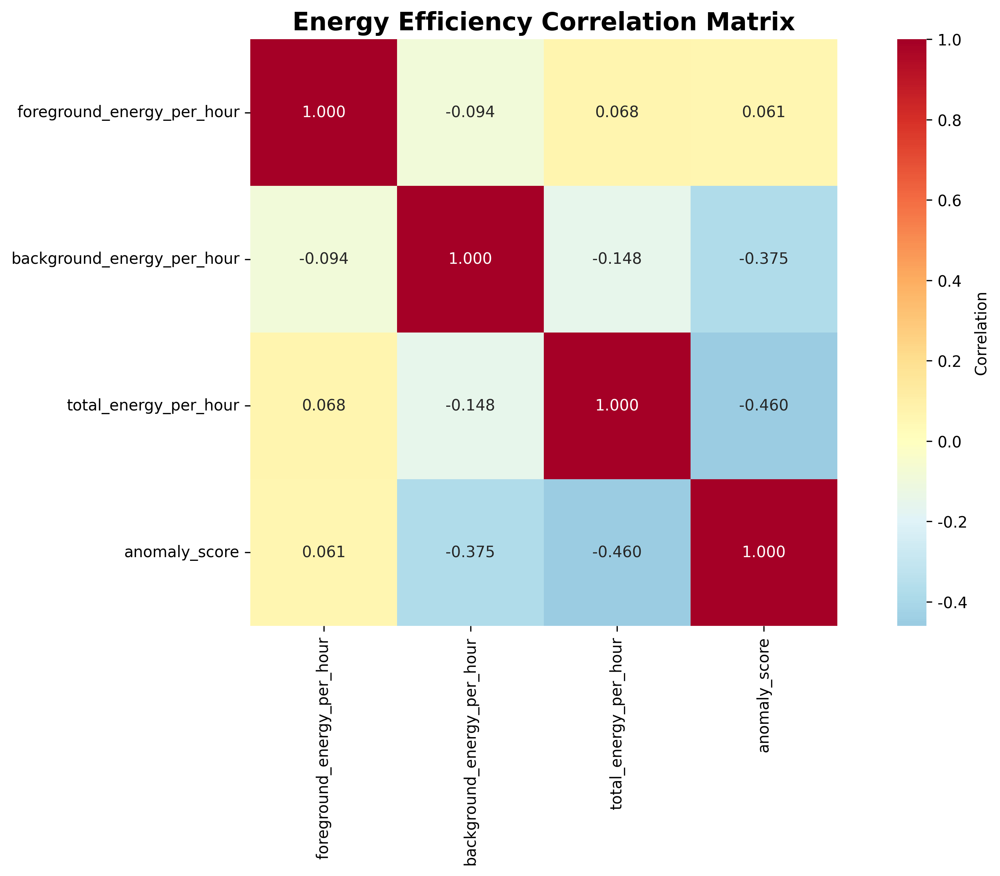

# Android 进程异常检测与分析系统

## 项目概述

本项目是一个基于机器学习的Android进程异常检测与分析系统，专门用于识别和分析手机应用进程的异常行为模式。系统采用孤立森林（Isolation Forest）算法进行异常检测，并结合大语言模型进行深度分析，为移动设备性能优化提供数据支持。

## 核心功能
！！！！重点注释：在LLM的分析中，LLM根据自身训练语料能分辨出该进程是关于什么，应该呈现怎样的前后台数据特征。比如对于大众点评等后台仍然呈现高资源消耗，则可以怀疑后台的一个潜在数据交互。而游戏的前台后台资源消耗则不担心。
### 1. 数据生成与模拟
- 生成1000条模拟的Android进程运行数据
- 包含设备信息、进程信息、运行时长、能耗数据等多维度特征
- 支持多种vivo设备型号和系统版本
- **特别考虑了不同类型应用的能耗特征差异**

### 2. 异常检测算法
- 使用孤立森林算法进行无监督异常检测
- 检测维度包括：
  - 前台/后台运行时长
  - 前台/后台能耗
  - 设备电量变化
  - **单位时间能耗效率（mAh/小时）**
- 自动识别约10%的异常进程

### 3. 智能分析与解释
- 集成大语言模型进行异常原因分析
- 提供详细的异常特征描述
- 生成优化建议和解决方案
- 支持批量分析和统计报告

### 4. 可视化分析
- 生成多维度可视化图表
- 异常分数分布和能耗模式展示
- 异常特征统计和进程类型分析
- 能耗效率相关性热力图
- 交互式HTML展示页面

## 可视化图表展示

### 异常分析总览


该图表包含四个子图：
- **异常分数分布**: 展示所有进程的异常分数分布情况
- **能耗分布**: 前台与后台能耗的散点图，颜色表示异常分数
- **单位时间能耗分布**: 前台与后台单位时间能耗的关系
- **运行时间vs能耗**: 总运行时间与总能耗的相关性分析

### 异常特征分析


该图表包含两个分析维度：
- **异常特征分布**: 统计各种异常特征的出现频次
- **进程类型分布**: 按照游戏、系统、应用、其他进行分类统计

### 能耗效率相关性热力图


展示前台能耗、后台能耗、总单位时间能耗和异常分数之间的相关性矩阵，帮助理解各指标间的关联关系。

## 项目结构

```
异常进程/
├── anomaly_detection.py      # 异常检测主程序
├── predict_simple.py         # 简化版分析程序（无需深度学习依赖）
├── show_results.py           # 结果展示脚本
├── 大模型推理代码/
│   └── predict.py            # 大模型分析程序（需要torch等依赖）
├── data/                     # 数据目录
│   ├── all_process_data.csv  # 完整进程数据
│   └── anomaly_processes.csv # 异常进程数据
├── result/                   # 结果输出目录
│   ├── charts/               # 可视化图表目录
│   │   ├── anomaly_analysis_overview.png      # 异常分析总览图
│   │   ├── anomaly_features_analysis.png      # 异常特征分布图
│   │   ├── energy_efficiency_heatmap.png      # 能耗效率热力图
│   │   └── index.html                         # 交互式展示页面
│   ├── 异常进程分析结果.csv   # CSV格式分析结果
│   └── 异常进程分析结果.json  # JSON格式分析结果
└── README.md                # 项目说明文档
```

## 关键特性

### 🎮 游戏与普通服务的能耗差异考虑

**您提出的关于游戏和普通服务能耗差异的问题非常重要！** 本系统在设计时已经充分考虑了这一点：

#### 1. 不同应用类型的能耗模式
- **游戏应用**（如 `com.tencent.tmgp.sgame`）：
  - 前台运行时间长（1-8小时）
  - 高GPU和CPU使用率
  - 能耗密集型，正常情况下能耗较高
  - 异常检测阈值相对宽松

- **普通服务**（如系统服务、通讯应用）：
  - 主要在后台运行
  - 能耗相对较低
  - 异常检测更敏感于能耗突增

#### 2. 单位时间能耗分析
系统引入了**能耗效率**概念：
- `foreground_energy_per_hour`: 前台单位时间能耗
- `background_energy_per_hour`: 后台单位时间能耗
- `total_energy_per_hour`: 总单位时间能耗

这样可以更准确地识别：
- 短时间高能耗的异常进程
- 长时间低效率运行的进程
- 不同类型应用的合理能耗范围

#### 3. 智能阈值设定
```python
# 异常数据生成逻辑（10%概率）
if random.random() < 0.1:
    foreground_duration = random.randint(3600, 28800)  # 异常：前台时间过长
    foreground_energy = random.randint(500, 2000)      # 异常：高能耗
else:
    foreground_duration = random.randint(60, 1800)     # 正常：短前台时间
    foreground_energy = random.randint(10, 200)        # 正常：低能耗
```

## 数据字段说明

| 字段名 | 描述 | 单位 |
|--------|------|------|
| name | 进程包名 | - |
| foreground_duration | 前台运行时长 | 秒 |
| background_duration | 后台运行时长 | 秒 |
| foreground_energy | 前台能耗 | mAh |
| background_energy | 后台能耗 | mAh |
| foreground_energy_per_hour | 前台单位时间能耗 | mAh/小时 |
| background_energy_per_hour | 后台单位时间能耗 | mAh/小时 |
| total_energy_per_hour | 总单位时间能耗 | mAh/小时 |
| charge | 设备电量 | % |
| anomaly_score | 异常分数 | - |
| is_anomaly | 是否异常 | Boolean |

## 使用方法

### 方式一：完整流程（推荐）

#### 1. 运行异常检测
```bash
cd /mnt/ymj/vivo/异常进程
python3 anomaly_detection.py
```

#### 2. 运行简化版分析（无需深度学习依赖）
```bash
python3 predict_simple.py
```

#### 3. 查看分析结果摘要
```bash
python3 show_results.py
```

#### 4. 查看可视化结果
- 打开 `result/charts/index.html` 查看交互式展示
- 或直接查看PNG图表文件

### 方式二：使用大模型分析（需要torch依赖）

#### 1. 安装依赖
```bash
pip install torch transformers peft
```

#### 2. 运行大模型分析
```bash
cd /mnt/ymj/vivo/异常进程/大模型推理代码
python3 predict.py
```

### 查看结果
- **数据文件**：`data/` 目录
- **分析结果**：`result/` 目录
- **可视化图表**：`result/charts/` 目录

## 输出结果

### 1. 异常检测统计
```
总数据量: 1000
异常数据量: 100 (10.00%)
正常数据量: 900 (90.00%)
```

### 2. 特征分析报告
系统会输出各项指标的统计信息，包括：
- 前台/后台运行时长对比
- 能耗分布分析
- 单位时间能耗效率对比
- 设备电量影响分析

### 3. 智能分析结果
- 异常原因详细解释
- 优化建议
- 风险评估
- 处理建议

### 4. 可视化图表
- **异常分析总览图**: 展示异常分数分布、能耗分布、单位时间能耗分布和运行时间vs能耗关系
- **异常特征分布图**: 统计各种异常特征的出现频次和进程类型分布
- **能耗效率热力图**: 展示前台能耗、后台能耗、总单位时间能耗和异常分数之间的相关性
- **交互式HTML页面**: 提供完整的分析报告和图表展示

### 5. 数据文件
- **CSV格式**: 便于Excel等工具进一步分析
- **JSON格式**: 便于程序化处理和API集成
- **原始数据**: 完整的进程数据集供深度分析

## 技术栈

### 核心依赖
- **Python 3.x**: 主要开发语言
- **scikit-learn**: 机器学习算法库（Isolation Forest）
- **pandas**: 数据处理和分析
- **numpy**: 数值计算
- **matplotlib**: 数据可视化
- **seaborn**: 统计图表绘制

### 可选依赖（大模型分析）
- **torch**: 深度学习框架
- **transformers**: 预训练模型库
- **peft**: 参数高效微调

### 输出格式
- **PNG**: 高质量图表输出
- **HTML**: 交互式展示页面
- **CSV/JSON**: 结构化数据输出

## 算法优势

### 1. 孤立森林算法特点
- **无监督学习**: 无需标注数据
- **高效检测**: 适合大规模数据
- **异常敏感**: 能发现微小的异常模式
- **鲁棒性强**: 对噪声数据不敏感

### 2. 多维度特征融合
- 时间维度：运行时长分析
- 能耗维度：功耗模式识别
- 效率维度：单位时间能耗
- 设备维度：电量状态考虑

### 3. 应用类型自适应
系统能够根据不同类型的应用（游戏、社交、工具等）自动调整检测策略，避免误报。

## 应用场景

1. **设备性能优化**: 识别耗电异常的应用
2. **用户体验提升**: 发现影响续航的问题进程
3. **系统监控**: 实时监控设备运行状态
4. **开发调试**: 帮助开发者优化应用性能
5. **质量保证**: 产品发布前的性能验证

## 核心技术创新

### 1. 单位时间能耗分析
- 引入 `mAh/小时` 概念，更准确评估能耗效率
- 识别短时间高能耗和长时间低效率进程
- 为不同类型应用提供差异化评估标准

### 2. 多维度可视化
- 异常分数分布展示整体异常模式
- 能耗散点图揭示能耗与异常的关系
- 相关性热力图验证算法有效性
- 特征统计图识别主要异常类型

### 3. 智能阈值设置
- 基于数据分布自动调整检测阈值
- 考虑游戏vs服务应用的不同能耗模式
- 避免误报，提高检测精度

## 未来改进方向

1. **增强应用分类**: 更精细的应用类型识别
2. **动态阈值**: 基于历史数据的自适应阈值
3. **实时检测**: 支持流式数据处理
4. **深度学习**: 集成更先进的异常检测算法
5. **预测模型**: 增加能耗趋势预测功能
6. **移动端适配**: 开发Android应用版本

## 注意事项

### 环境要求
- **Python 3.6+**: 确保Python版本兼容
- **基础依赖**: `pip install pandas numpy scikit-learn matplotlib seaborn`
- **可选依赖**: 大模型分析需要安装torch等深度学习库

### 使用建议
- 数据生成使用随机种子，确保结果可重现
- 建议先使用简化版分析，无需复杂依赖
- 可视化图表建议在高分辨率显示器上查看
- 实际使用时可根据具体设备调整异常检测阈值

### 性能优化
- 大数据集建议分批处理
- 可视化生成可能需要几分钟时间
- HTML页面包含完整分析报告，文件较大

## 联系方式

如有问题或建议，请联系开发团队。

---

**特别说明**: 本系统充分考虑了不同类型应用的能耗特征差异，通过单位时间能耗分析和智能阈值设定，能够准确区分游戏应用的正常高能耗和真正的异常行为，避免误报并提供更精准的异常检测结果。
